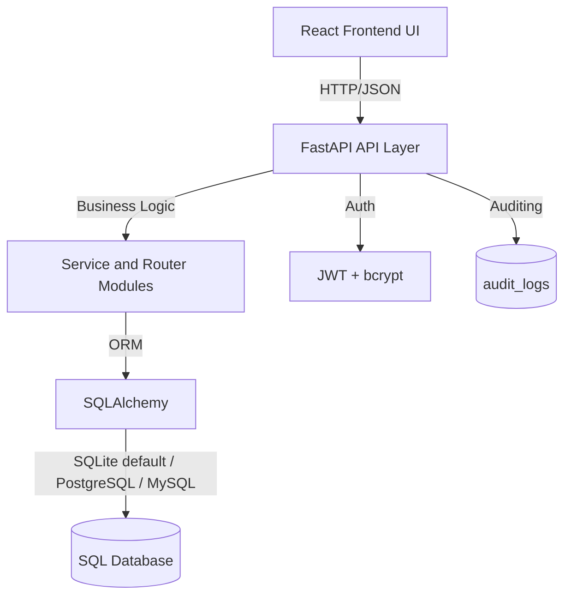

# Banking API and Operations UI

Welcome to **Banking API and Operations UI**, a production-style banking solution built with FastAPI, SQLAlchemy, SQLite, and React. This app is designed to handle core banking operations like account lifecycle management, transfers, debit card controls, mutual funds, deposits, and audit logging, with a documented API that is easy to integrate into other applications.

## Key Features
- End-to-end banking modules: users, accounts, transactions, debit cards, mutual funds, deposits, and audit logs.
- JWT-based authentication with bcrypt password hashing and role-based access (admin/user).
- Additive schema compatibility at startup (create missing tables + add missing columns without deleting data).
- Full web UI for CRUD and workflow operations across all core banking entities.
- SQL portability support with migration scripts for PostgreSQL and MySQL.

---

## Table of Contents
1. [Getting Started](#getting-started)
2. [Running Locally](#running-locally)
3. [API Usage and Examples](#api-usage-and-examples)
4. [Integration in Other Applications](#integration-in-other-applications)
5. [Access to Frontend UI](#access-to-frontend-ui)
6. [Architecture Overview](#architecture-overview)
7. [Credits and License](#credits-and-license)

---

## Getting Started

### Prerequisites
Before you proceed, make sure you have the following installed:
- Python 3.11+ (3.x supported)
- Node.js 18+ and npm
- `venv` for virtual environments
- cURL (for API interaction)
- Git (for cloning the repository)

---

## Running Locally

Follow these steps to run the application on your local machine.

### Step 1: Clone the Repository
```bash
git clone <your-repository-url>
cd banking_api
```

### Step 2: Create and Activate a Virtual Environment
- Create the virtual environment:
    ```bash
    python -m venv .venv
    ```
- Activate the virtual environment:
    - On Windows:
        ```bash
        .\.venv\Scripts\activate
        ```
    - On macOS/Linux:
        ```bash
        source .venv/bin/activate
        ```

### Step 3: Install Backend Dependencies
```bash
cd backend
pip install -r requirements.txt
```

### Step 4: Configure Environment Variables
- Create `.env` from example:
    - On Windows:
      ```bash
      copy .env.example .env
      ```
    - On macOS/Linux:
      ```bash
      cp .env.example .env
      ```

Default bootstrap admin credentials:
- Email: `admin@bankexample.com`
- Password: `Admin@12345`

### Step 5: Launch the Backend API
```bash
uvicorn main:app --reload --host 0.0.0.0 --port 8000
```

API docs will be available at:
- `http://127.0.0.1:8000/docs`

### Step 6: Launch the Frontend UI (New Terminal)
```bash
cd frontend
npm install
npm run dev
```

Frontend will run at:
- `http://127.0.0.1:5173`

Optional API base override for frontend:
- On Windows:
  ```bash
  set VITE_API_BASE_URL=http://127.0.0.1:8000/api/v1
  ```
- On macOS/Linux:
  ```bash
  export VITE_API_BASE_URL=http://127.0.0.1:8000/api/v1
  ```

### Step 7: Run Tests (Optional)
```bash
cd backend
python -m pytest -q
```

### Step 8: Deactivate the Environment (Post Usage)
```bash
deactivate
```

---

## API Usage and Examples

The app provides a REST API with a standard response envelope:

```json
{
  "status": "success/error",
  "message": "Description",
  "data": {}
}
```

### Base URL
```text
http://127.0.0.1:8000/api/v1
```

### Example Endpoints
#### 1. Login and Get JWT Token
- **Endpoint:**
    ```text
    POST /auth/token
    ```
- **Example cURL Call:**
    ```bash
    curl -X POST http://127.0.0.1:8000/api/v1/auth/token \
      -H "Content-Type: application/json" \
      -d '{"email":"admin@bankexample.com","password":"Admin@12345"}'
    ```
- **Sample Response (JSON):**
    ```json
    {
      "status": "success",
      "message": "Authentication successful",
      "data": {
        "access_token": "<jwt_token>",
        "token_type": "bearer",
        "user_id": 1
      }
    }
    ```

#### 2. Create Account
- **Endpoint:**
    ```text
    POST /accounts/
    ```
- **Example cURL Call:**
    ```bash
    curl -X POST http://127.0.0.1:8000/api/v1/accounts/ \
      -H "Authorization: Bearer <jwt_token>" \
      -H "Content-Type: application/json" \
      -d '{"user_id":1,"account_type":"savings","initial_deposit":5000}'
    ```
- **Sample Response (JSON):**
    ```json
    {
      "status": "success",
      "message": "Account created",
      "data": {
        "account_id": 101
      }
    }
    ```

#### 3. Transfer Funds
- **Endpoint:**
    ```text
    POST /transactions/
    ```
- **Example cURL Call:**
    ```bash
    curl -X POST http://127.0.0.1:8000/api/v1/transactions/ \
      -H "Authorization: Bearer <jwt_token>" \
      -H "Content-Type: application/json" \
      -d '{"from_account_id":101,"to_account_id":102,"amount":1000,"description":"Rent"}'
    ```
- **Sample Response (JSON):**
    ```json
    {
      "status": "success",
      "message": "Transaction successful",
      "data": {
        "transaction_id": 501
      }
    }
    ```

#### 4. Activate Debit Card with OTP
- **Endpoint:**
    ```text
    PUT /debit-cards/activate
    ```
- **Example cURL Call:**
    ```bash
    curl -X PUT http://127.0.0.1:8000/api/v1/debit-cards/activate \
      -H "Authorization: Bearer <jwt_token>" \
      -H "Content-Type: application/json" \
      -d '{"card_id":201,"otp":"123456"}'
    ```
- **Sample Response (JSON):**
    ```json
    {
      "status": "success",
      "message": "Card activated",
      "data": {
        "card_id": 201
      }
    }
    ```

---

## Integration in Other Applications

You can integrate the Banking API with any service that can call HTTP endpoints.

### Using JavaScript (Axios Example)
```javascript
import axios from "axios";

const api = axios.create({
  baseURL: "http://127.0.0.1:8000/api/v1",
});

async function run() {
  const login = await api.post("/auth/token", {
    email: "admin@bankexample.com",
    password: "Admin@12345",
  });

  const token = login.data.data.access_token;

  const accounts = await api.get("/accounts/", {
    headers: { Authorization: `Bearer ${token}` },
  });

  console.log(accounts.data);
}

run().catch(console.error);
```

### Using Python (Requests Library Example)
```python
import requests

BASE_URL = "http://127.0.0.1:8000/api/v1"

login_resp = requests.post(
    f"{BASE_URL}/auth/token",
    json={"email": "admin@bankexample.com", "password": "Admin@12345"},
)
login_resp.raise_for_status()

token = login_resp.json()["data"]["access_token"]
headers = {"Authorization": f"Bearer {token}"}

accounts_resp = requests.get(f"{BASE_URL}/accounts/", headers=headers)
accounts_resp.raise_for_status()
print(accounts_resp.json())
```

---

## Access to Frontend UI

To access the application's frontend UI, follow these steps:
1. Ensure the backend server is running (see [Running Locally](#running-locally)).
2. Ensure the frontend dev server is running with `npm run dev`.
3. Open your browser and navigate to:
    ```text
    http://127.0.0.1:5173
    ```
4. Use the UI to perform CRUD and workflows for users, accounts, transfers, debit cards, mutual funds, deposits, and audit logs.

---

## Architecture Overview



---

## Credits and License

- **Developed By**: Raghavendra Chowdary
- **License**: MIT.
- Contributions are welcome through pull requests and issues.

---

If you need additional endpoint-level docs, use the live Swagger UI at `http://127.0.0.1:8000/docs`.
